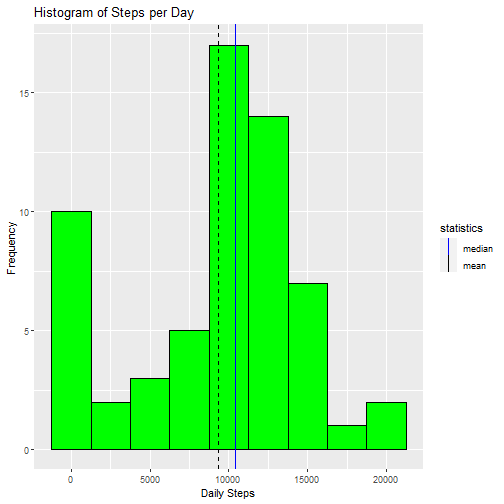

## Peer-graded Assignment: Course Project 1

## Loading and preprocessing the data


This document contains activity monitoring in 5 minute intervals thoughout the day. The data will look to show histogram data for number of steps per day, average steps per interval in both the current dataset as well as a dataset with imputed data.  This study will also explore the differnces in weekday activity vs weekend data on the imputed data.  

The script will line of code will bring in the data from the URL listed  and store the data in your current working directory in its own folder named Activity Monitoring. You will notice from the head that there are NA values returned in the data set.  

[Activity Data](https://d396qusza40orc.cloudfront.net/repdata%2Fdata%2Factivity.zip)


```r
#code to create folder in current working directory
if(!file.exists("./Activity Monitoring")){dir.create("./Activity Monitoring")}

##variable to save the url to data  
fileurl <- "https://d396qusza40orc.cloudfront.net/repdata%2Fdata%2Factivity.zip"

##downloadfile from URL and store in folder Activity Monitoring
download.file(fileurl,destfile="./Activity Monitoring/AMdata.zip", method = "curl")

##unzip folder command
unzip(zipfile="./Activity Monitoring/AMdata.zip", exdir="./Activity Monitoring")


data<-read.csv("./Activity Monitoring/activity.csv", header=TRUE)

head(data)
```

```
##   steps       date interval
## 1    NA 2012-10-01        0
## 2    NA 2012-10-01        5
## 3    NA 2012-10-01       10
## 4    NA 2012-10-01       15
## 5    NA 2012-10-01       20
## 6    NA 2012-10-01       25
```


## What is mean total number of steps taken per day?


The first script in the code will format the data into groups by day removing the NA values and print the head of the data. Note that this ends in many days with 0 steps as a result of the NAs in the data set


```r
library(dplyr)
```

```
## 
## Attaching package: 'dplyr'
```

```
## The following objects are masked from 'package:stats':
## 
##     filter, lag
```

```
## The following objects are masked from 'package:base':
## 
##     intersect, setdiff, setequal, union
```

```r
library(ggplot2)
library(tidyr)

datagroup<- data %>% 
  group_by(date) %>% 
  summarise(sum= sum(steps, na.rm=TRUE))

head(datagroup)
```

```
## # A tibble: 6 x 2
##   date         sum
##   <chr>      <int>
## 1 2012-10-01     0
## 2 2012-10-02   126
## 3 2012-10-03 11352
## 4 2012-10-04 12116
## 5 2012-10-05 13294
## 6 2012-10-06 15420
```

The below script produces a histogram of the total steps by day with verticle lines in the location of the mean and the median of the data set.


```r
g<-qplot(datagroup$sum, geom="histogram", binwidth=2500, col=I("black"), fill=I("green"))+
  geom_vline(aes(xintercept=mean(datagroup$sum), color="mean"), show.legend=TRUE, linetype="dashed")+
  geom_vline(aes(xintercept=median(datagroup$sum), color="median"), show.legend=TRUE)+
  labs(x="Daily Steps", y="Frequency", title="Histogram of Steps per Day") +
  scale_color_manual(name = "statistics", values = c(median = "blue", mean = "black"))
  
g
```



The average steps per day:

```r
mean(datagroup$sum, na.rm=TRUE)
```

```
## [1] 9354.23
```

The median steps per day:

```r
median(datagroup$sum, na.rm=TRUE)
```

```
## [1] 10395
```

## What is the average daily activity pattern?


The below script takes the data provided in the activity file and groups it by interval and summarizes the data into average steps within each interval.


```r
datagroup2<- data %>% 
  group_by(interval) %>% 
  summarise(Step_Avg= mean(steps, na.rm=TRUE))

head(datagroup2)
```

```
## # A tibble: 6 x 2
##   interval Step_Avg
##      <int>    <dbl>
## 1        0   1.72  
## 2        5   0.340 
## 3       10   0.132 
## 4       15   0.151 
## 5       20   0.0755
## 6       25   2.09
```


Next, a plot is constructed in a line plot of the average steps taken at each interval.

```r
g2<-ggplot(datagroup2, aes(x=interval, y=Step_Avg))+geom_line()+labs(x="Interval",y="Avg Steps" )


g2
```


The average maximum steps are taken at interval 835 or 8:35.


```r
max<-which.max(datagroup2$Step_Avg)

imax<-datagroup2[max,1]

imax[[1]]
```

```
## [1] 835
```


## Imputing missing values


The above data all includes missing values and NAs as a resultant in the data set.  This will skew what the actual data should have been.  To get a better representation of the data this will require imputing data.  For this we will use the r package mice.  The code below shows the number of missing data in the dataset.


```r
Nas<-sum(is.na(data$steps))
dim(data)
```

```
## [1] 17568     3
```

```r
Nas
```

```
## [1] 2304
```

The below code utilizes the mice package to model the data and impute missing values into the data set. For the purpose of reproducibility for the model we will set the seed equal to a constant. This ouptuts a data set the same dimensions as our initial data set with 0 values and steps imputed for NAs.


```r
library(mice)
```

```
## 
## Attaching package: 'mice'
```

```
## The following object is masked from 'package:stats':
## 
##     filter
```

```
## The following objects are masked from 'package:base':
## 
##     cbind, rbind
```

```r
impute<-mice(data,m=5,  seed=245435)
```

```
## 
##  iter imp variable
##   1   1  steps
##   1   2  steps
##   1   3  steps
##   1   4  steps
##   1   5  steps
##   2   1  steps
##   2   2  steps
##   2   3  steps
##   2   4  steps
##   2   5  steps
##   3   1  steps
##   3   2  steps
##   3   3  steps
##   3   4  steps
##   3   5  steps
##   4   1  steps
##   4   2  steps
##   4   3  steps
##   4   4  steps
##   4   5  steps
##   5   1  steps
##   5   2  steps
##   5   3  steps
##   5   4  steps
##   5   5  steps
```

```
## Warning: Number of logged events: 1
```

```r
imputedata<-complete(impute, 5)
head(imputedata)
```

```
##   steps       date interval
## 1     0 2012-10-01        0
## 2     0 2012-10-01        5
## 3     0 2012-10-01       10
## 4     0 2012-10-01       15
## 5     0 2012-10-01       20
## 6     0 2012-10-01       25
```

```r
dim(imputedata)
```

```
## [1] 17568     3
```

```r
Nas<-sum(is.na(imputedata$steps))
Nas
```

```
## [1] 0
```

You will see the difference in the histogram as the number of days with 0 steps taken is now zero and the average steps taken have increased as well as the median.

```r
datagroup3<- imputedata %>% 
  group_by(date) %>% 
  summarise(sum= sum(steps, na.rm=TRUE))


g2<-qplot(datagroup3$sum, geom="histogram", binwidth=2500, col=I("black"), fill=I("green"))+
  geom_vline(aes(xintercept=mean(datagroup3$sum), color="mean"), show.legend=TRUE, linetype="dashed")+
  geom_vline(aes(xintercept=median(datagroup3$sum), color="median"), show.legend=TRUE)+
  labs(x="Daily Steps", y="Frequency", title="Histogram of Steps per Day") +
  scale_color_manual(name = "statistics", values = c(median = "blue", mean = "black"))

g2
```


```r
mean(datagroup$sum, na.rm=TRUE)
```

```
## [1] 9354.23
```

```r
median(datagroup$sum, na.rm=TRUE)
```

```
## [1] 10395
```

Now that the data has been imputed and corrected for the days with 0 step totals coerced by the NA values the data follows a normal distribution. 

## Are there differences in activity patterns between weekdays and weekends?
Looking at the imputed data we will now look to see if there is a difference between steps taken on weekdays vs weekends.  To do this we must add a variable to the dataset indicating if there is a weekday or a weekend.  For this we will use the lubridate and chron packages.


```r
library(lubridate)
```

```
## 
## Attaching package: 'lubridate'
```

```
## The following objects are masked from 'package:base':
## 
##     date, intersect, setdiff, union
```

```r
library(chron)
```

```
## 
## Attaching package: 'chron'
```

```
## The following objects are masked from 'package:lubridate':
## 
##     days, hours, minutes, seconds, years
```

```r
##converts date from character to a date time
data$date <- as.Date(strptime(data$date, format="%Y-%m-%d"))

imputedata$weekends<-is.weekend(imputedata$date)


datagroupweekend<- imputedata %>%  
  group_by(interval, weekends) %>% 
  summarise(sum= mean(steps, na.rm=TRUE))%>%
  mutate(weekday = case_when(weekends==FALSE ~ "Weekday", weekends==TRUE ~ "Weekend")) 
```

```
## `summarise()` has grouped output by 'interval'. You can override using the `.groups` argument.
```

```r
head(datagroupweekend)
```

```
## # A tibble: 6 x 4
## # Groups:   interval [3]
##   interval weekends   sum weekday
##      <int> <lgl>    <dbl> <chr>  
## 1        0 FALSE    2.02  Weekday
## 2        0 TRUE     0     Weekend
## 3        5 FALSE    0.4   Weekday
## 4        5 TRUE     0     Weekend
## 5       10 FALSE    0.156 Weekday
## 6       10 TRUE     0     Weekend
```

```r
g<-ggplot(datagroupweekend, aes(interval, sum))+
  geom_line(aes(colour=factor(as.factor(datagroupweekend$weekday)))) +
  labs(x="Interval", y="Steps", title="Total Steps by Interval", colour="Weekend or Weekday") + 
  facet_grid(weekday~.)

g
```


